 

# 
Bonjour👋 

 

    <b> 
        Undergraduate / 💻 Hardware Engineer / 🔬 Junior Researcher / 🎥 Weekend Photographer 
    </b>

 

    
    

 

## About me
- 🏫 University Undergraduate  
- 🐕‍🦺 Certified outstanding Community Volunteer
- 🧑‍🏫 University Peer academic mentor
- 📷 Amateur Photographer
- ✈️ Sparetime UAV Pilot  
- 🪂 Sports Enthusiast

 

## Tech Stack

### Coding

    

 

    
    
    

 

    
    

 

    
    

### Analysis

    
    
    

### Hardware

    
    

    
    
    

 

## Activities

<!---
BoningtonChen/BoningtonChen is a ✨ special ✨ repository because its `README.md` (this file) appears on your GitHub profile.
You can click the Preview link to take a look at your changes.
--->